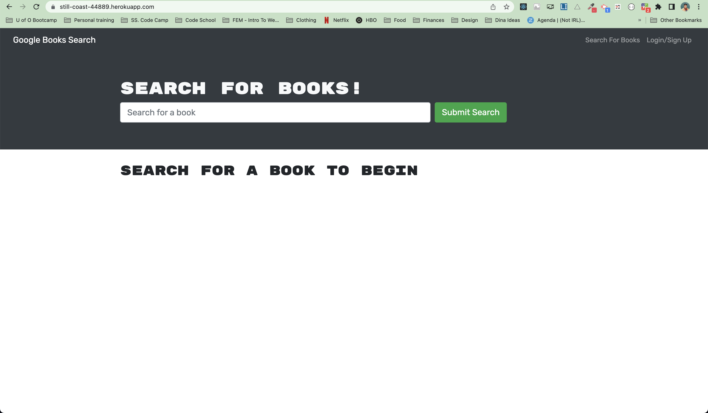

# Find A Novel

## Description

Find A Novel is a Book Search Engine that was refactored to use GraphQL, not just an API to search, save, or remove a book.

## Table of Contents

If your README is long, add a table of contents to make it easy for users to find what they need.

- [Installation](#installation)
- [Usage](#usage)
- [Credits](#credits)
- [License](#license)

## Installation

In order to install and run this project locally you'll need to clone the repo to your local machine then:

1. Run `npm i` on the root level
2. From the roote run `npm run develop` to start both the client and server on the project

## Usage

To use this app you can visit the following deployed link:  

https://still-coast-44889.herokuapp.com/  

Then Log In or create an account to start searching for and saving books to your profile.  

Below is a screenshot of what the app looks like:  

  

## Credits

- [GraphQL](https://graphql.org/)
- [Apollo-Server](https://www.apollographql.com/docs/apollo-server/)
- [MongoDB](https://www.mongodb.com/)

## License

MIT License

Copyright (c) [2022] [Emily Dokken]

Permission is hereby granted, free of charge, to any person obtaining a copy
of this software and associated documentation files (the "Software"), to deal
in the Software without restriction, including without limitation the rights
to use, copy, modify, merge, publish, distribute, sublicense, and/or sell
copies of the Software, and to permit persons to whom the Software is
furnished to do so, subject to the following conditions:

The above copyright notice and this permission notice shall be included in all
copies or substantial portions of the Software.

THE SOFTWARE IS PROVIDED "AS IS", WITHOUT WARRANTY OF ANY KIND, EXPRESS OR
IMPLIED, INCLUDING BUT NOT LIMITED TO THE WARRANTIES OF MERCHANTABILITY,
FITNESS FOR A PARTICULAR PURPOSE AND NONINFRINGEMENT. IN NO EVENT SHALL THE
AUTHORS OR COPYRIGHT HOLDERS BE LIABLE FOR ANY CLAIM, DAMAGES OR OTHER
LIABILITY, WHETHER IN AN ACTION OF CONTRACT, TORT OR OTHERWISE, ARISING FROM,
OUT OF OR IN CONNECTION WITH THE SOFTWARE OR THE USE OR OTHER DEALINGS IN THE
SOFTWARE.

